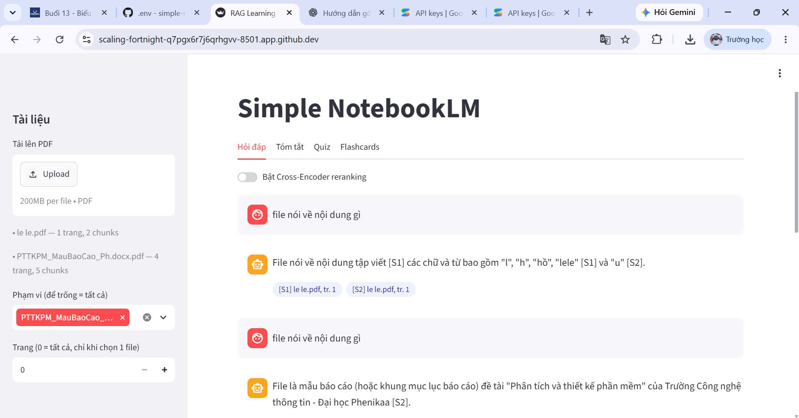
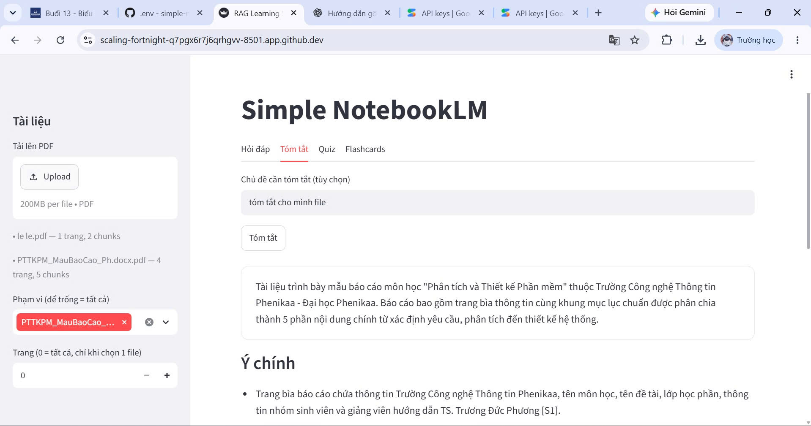
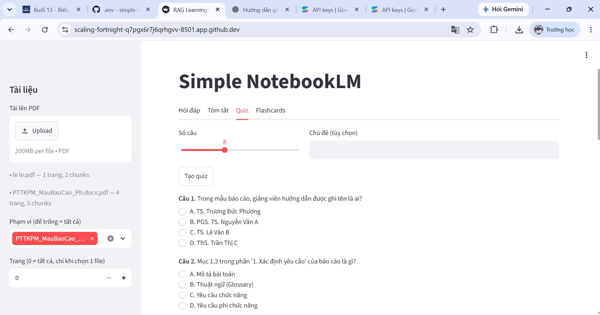
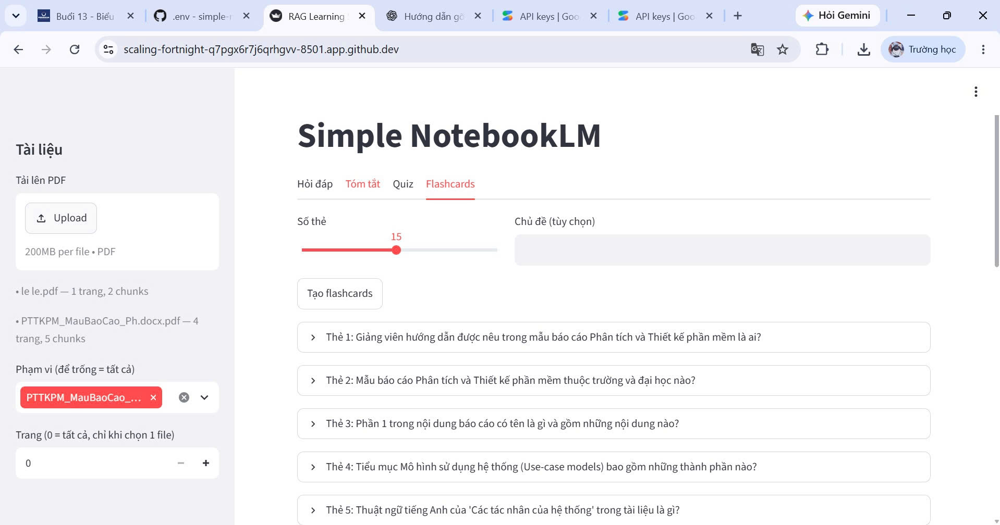

<div align="center">


### 🌷 *Learn beautifully. Search intelligently. Remember effortlessly.*

<br/>


<br/>

**`PDF` → `Chunking` → `Embedding` → `Qdrant` → `Retrieval` → `Reranking` → `Gemini` → `Answer + Citations`**

<br/>

> **Simple NotebookLM** biến tài liệu PDF cá nhân thành một trợ lý học tập AI có khả năng  
> **hỏi đáp có trích dẫn · tóm tắt · tạo quiz · tạo flashcards · đánh giá RAG**

</div>

---

## ୨୧ Mục lục

- [🌸 Giới thiệu](#-giới-thiệu)
- [✨ Tính năng nổi bật](#-tính-năng-nổi-bật)
- [🎀 Demo giao diện](#-demo-giao-diện)
- [🧠 Kiến trúc RAG](#-kiến-trúc-rag)
- [🛠️ Công nghệ](#️-công-nghệ)
- [🚀 Cài đặt nhanh](#-cài-đặt-nhanh)
- [🔑 Cấu hình Gemini API](#-cấu-hình-gemini-api)
- [🖥️ Chạy Web App](#️-chạy-web-app)
- [⌨️ Sử dụng CLI](#️-sử-dụng-cli)
- [📊 RAG Evaluation](#-rag-evaluation)
- [🧪 Testing](#-testing)
- [📁 Cấu trúc project](#-cấu-trúc-project)
- [⚠️ Lưu ý kỹ thuật](#️-lưu-ý-kỹ-thuật)
- [🤍 AI Assistance](#-ai-assistance)

---

# 🌸 Giới thiệu

**Simple NotebookLM** là hệ thống học tập thông minh trên tài liệu PDF cá nhân, được xây dựng theo kiến trúc  
**Retrieval-Augmented Generation (RAG)**.

Thay vì để mô hình ngôn ngữ trả lời hoàn toàn bằng kiến thức có sẵn, hệ thống sẽ tìm kiếm những đoạn nội dung liên quan ngay trong PDF của người dùng, sau đó xếp hạng lại và đưa chúng vào prompt trước khi gọi LLM.

<div align="center">

### ✦ Một tài liệu — nhiều cách học ✦

`📄 Đọc PDF`　`💬 Hỏi đáp`　`📝 Tóm tắt`　`🎯 Quiz`　`🧠 Flashcards`

</div>

> [!TIP]
> Mục tiêu của project là giúp việc học từ tài liệu dài trở nên **nhanh hơn, có cấu trúc hơn và có căn cứ nguồn rõ ràng hơn**.

---

# ✨ Tính năng nổi bật

<table>
<tr>
<td width="50%" valign="top">

### 💬 RAG Question Answering
Hỏi trực tiếp trên nội dung PDF và nhận câu trả lời có trích dẫn nguồn dạng **[S1] [S2]...**

</td>
<td width="50%" valign="top">

### 📝 Smart Summary
Tóm tắt tài liệu theo chiến lược **single-pass / map-reduce**, kèm các ý chính quan trọng.

</td>
</tr>

<tr>
<td valign="top">

### 🎯 Quiz Generator
Tự động tạo câu hỏi trắc nghiệm để hỗ trợ ôn tập và tự kiểm tra kiến thức.

</td>
<td valign="top">

### 🧠 Flashcards
Sinh bộ thẻ ghi nhớ từ tài liệu hoặc theo chủ đề mà người dùng lựa chọn.

</td>
</tr>

<tr>
<td valign="top">

### 🔎 Semantic Retrieval
Tìm kiếm theo ngữ nghĩa bằng **embedding**, thay vì chỉ khớp từ khóa đơn giản.

</td>
<td valign="top">

### 🏆 Cross-Encoder Reranking
Xếp hạng lại các đoạn truy xuất để chọn ra ngữ cảnh liên quan nhất trước khi gọi LLM.

</td>
</tr>

<tr>
<td valign="top">

### 📊 RAG Evaluation
So sánh các chiến lược **chunking + reranking** bằng bộ đánh giá **Ragas**.

</td>
<td valign="top">

### 📤 Export
Xuất **Summary / Quiz / Flashcards** sang Markdown hoặc JSON phục vụ học tập.

</td>
</tr>
</table>

---

# 🎀 Demo giao diện

<div align="center">

### ♡ Hỏi đáp RAG có trích dẫn



<sub>Truy xuất nội dung liên quan trong PDF và trả lời kèm nguồn tham chiếu.</sub>

<br/><br/>

### ♡ Tóm tắt tài liệu



<sub>Tổng hợp nội dung chính và các ý quan trọng từ tài liệu.</sub>

<br/><br/>

### ♡ Quiz Generator



<sub>Tạo câu hỏi trắc nghiệm trực tiếp từ kiến thức trong PDF.</sub>

<br/><br/>

### ♡ Flashcards



<sub>Biến nội dung tài liệu thành các thẻ ghi nhớ ngắn gọn.</sub>

</div>

---

# 🧠 Kiến trúc RAG

```mermaid
flowchart LR
    A["📄 PDF"] --> B["✂️ Chunking"]
    B --> C["🧠 Embedding"]
    C --> D[("🗄️ Qdrant")]

    Q["💭 User Question"] --> E["🔎 Retrieve Top 15"]
    D --> E
    E --> F["🏆 Cross-Encoder Reranker"]
    F --> G["🎯 Top 5 Chunks"]
    G --> H["📝 Jinja2 Prompt"]
    H --> I["✨ Gemini LLM"]
    I --> J["🌷 Answer + Citations"]

    style A fill:#F8DDE9,stroke:#C38DA6,color:#4B3F52
    style B fill:#FBEAF1,stroke:#C38DA6,color:#4B3F52
    style C fill:#EADFF8,stroke:#A38AB8,color:#4B3F52
    style D fill:#DDE3FF,stroke:#8D98C8,color:#4B3F52
    style E fill:#F8E8F0,stroke:#C38DA6,color:#4B3F52
    style F fill:#E9DEF6,stroke:#A38AB8,color:#4B3F52
    style G fill:#F5EBFA,stroke:#A38AB8,color:#4B3F52
    style H fill:#FCECF1,stroke:#C38DA6,color:#4B3F52
    style I fill:#E0E8FF,stroke:#8D98C8,color:#4B3F52
    style J fill:#F8DDE9,stroke:#C38DA6,color:#4B3F52
```



### Pipeline

```text
📄 PDF
   │
   ▼
✂️ Document Loading & Chunking
   │
   ▼
🧠 Embedding
   │
   ▼
🗄️ Qdrant Vector Store
   │
   ▼
🔎 Semantic Retrieval — Top 15
   │
   ▼
🏆 Cross-Encoder Reranking
   │
   ▼
🎯 Top 5 Relevant Chunks
   │
   ▼
📝 Jinja2 Prompt
   │
   ▼
✨ Gemini
   │
   ▼
🌷 Answer + Source Citations
```

---

# 🛠️ Công nghệ

<div align="center">

| ✦ Thành phần | Công nghệ |
|---|---|
| 🐍 Language | **Python** |
| ⚡ Backend API | **FastAPI + Uvicorn** |
| 🖥️ Web UI | **Streamlit** |
| 🤖 LLM | **Google Gemini** |
| 🧠 Embedding | **GreenNode/GreenNode-Embedding-Large-VN-Mixed-V1** |
| 🏆 Reranker | **BAAI/bge-reranker-v2-m3** |
| 🗄️ Vector Database | **Qdrant** |
| 🔗 RAG Ecosystem | **LangChain** |
| 📝 Prompt Template | **Jinja2** |
| 📄 PDF Processing | **PyPDF** |
| 📊 Evaluation | **Ragas** |
| 🧪 Testing | **Pytest** |

</div>

---

# 🚀 Cài đặt nhanh

## 1. Clone project

```bash
git clone <YOUR_REPOSITORY_URL>
cd simple-notebooklm
```

## 2. Tạo môi trường ảo

### Windows PowerShell

```powershell
python -m venv .venv
.venv\Scripts\Activate.ps1
```

### Windows CMD

```cmd
python -m venv .venv
.venv\Scripts\activate
```

### Linux / macOS / GitHub Codespaces

```bash
python3 -m venv .venv
source .venv/bin/activate
```

## 3. Cài thư viện

```bash
pip install -r requirements.txt
```

Nếu chạy bộ đánh giá:

```bash
pip install -r requirements-evaluation.txt
```

Nếu chạy test:

```bash
pip install -r requirements-dev.txt
```

> [!NOTE]
> Lần chạy đầu, hệ thống có thể tải **Embedding Model** và **Reranker** từ Hugging Face nên sẽ cần thêm thời gian và dung lượng.

---

# 🔑 Cấu hình Gemini API

Copy file mẫu:

### Windows PowerShell

```powershell
Copy-Item .env.example .env
```

### Linux / macOS / Codespaces

```bash
cp .env.example .env
```

Sau đó mở `.env`:

```env
RAG_LLM_PROVIDER=gemini
GOOGLE_API_KEY=YOUR_GOOGLE_API_KEY
RAG_GEMINI_MODEL=gemini-3.6-flash

RAG_EMBEDDING_MODEL=GreenNode/GreenNode-Embedding-Large-VN-Mixed-V1
RAG_HF_DEVICE=-1

RAG_CHUNK_SIZE=1000
RAG_CHUNK_OVERLAP=150
RAG_TOP_K=5

RAG_RERANKER_MODEL=BAAI/bge-reranker-v2-m3
RAG_RERANK_INITIAL_K=15
RAG_RERANK_TOP_K=5
```

> [!CAUTION]
> ### 🔐 Không đưa API key thật lên GitHub
>
> - `.env` → chứa API key thật, **chỉ giữ ở máy/Codespace**
> - `.env.example` → chỉ để placeholder `YOUR_GOOGLE_API_KEY`
> - `.gitignore` phải có dòng `.env`
> - Nếu key từng bị lộ, hãy **revoke và tạo key mới**

---

# 🖥️ Chạy Web App

Ứng dụng cần **2 terminal**.

### Terminal 1 — FastAPI

```bash
source .venv/bin/activate
uvicorn src.interfaces.api:app --host 0.0.0.0 --port 8000
```

Khi thành công:

```text
INFO: Application startup complete.
INFO: Uvicorn running on http://0.0.0.0:8000
```

### Terminal 2 — Streamlit

```bash
source .venv/bin/activate
python -m streamlit run src/interfaces/ui.py --server.address 0.0.0.0 --server.port 8501
```

Mở:

```text
http://localhost:8501
```

<div align="center">

### 🌷 Ready to learn

`Upload PDF` → `Index tài liệu` → `Hỏi đáp / Tóm tắt / Quiz / Flashcards`

</div>

---

# ⌨️ Sử dụng CLI

### 📥 Index tài liệu

```bash
python -m src.interfaces.cli ingest --recreate
```

### 💬 Hỏi đáp RAG

```bash
python -m src.interfaces.cli ask "RAG là gì?" --rerank
```

### 🔍 Debug Retrieval

```bash
python -m src.interfaces.cli debug-retrieval "RAG là gì?"
```

### 📝 Tóm tắt

```bash
python -m src.interfaces.cli summarize -d ten_file.pdf --fmt md -o out/summary.md
```

### 🎯 Tạo Quiz

```bash
python -m src.interfaces.cli quiz -d ten_file.pdf -n 8 --fmt json -o out/quiz.json
```

### 🧠 Tạo Flashcards

```bash
python -m src.interfaces.cli flashcards -q "LoRA" -n 10
```

### 🔎 Retrieval Filters

Một file + một trang:

```json
{"filename":"a.pdf","page":3}
```

Nhiều file:

```json
{"filenames":["a.pdf","b.pdf"]}
```

---

# 📊 RAG Evaluation

Project có module đánh giá để so sánh **chunking strategy** và **reranking**.

### 1. Tạo benchmark

```bash
python -m src.evaluation.make_benchmark --n 30
```

Benchmark:

```text
src/evaluation/benchmark_rag.csv
```

> File benchmark mẫu chỉ có một số câu ví dụ. Khi dùng tài liệu thật, nên tạo benchmark mới rồi đọc lại, chỉnh sửa và loại bỏ câu kém chất lượng.

### 2. Chạy thử nhanh

```bash
python -m src.evaluation.run_chunking --strategies rc_1000_150 --limit 5
```

### 3. Đánh giá Chunking

```bash
python -m src.evaluation.run_chunking
```

### 4. Đánh giá Reranking

```bash
python -m src.evaluation.run_reranking
```

Xem demo retrieval vs reranking:

```bash
python -m src.evaluation.run_reranking --demo
```

### 5. Sinh báo cáo

```bash
python -m src.evaluation.report
```

Kết quả nằm tại:

```text
src/evaluation/results/
```

Bao gồm:

```text
JSON kết quả từng cấu hình
CSV kết quả theo từng câu
report.md
chart_chunking.png
chart_reranking.png
```

> [!IMPORTANT]
> Ragas có thể tạo nhiều lời gọi LLM. Khi thử nghiệm nên dùng `--limit`, giảm `--max-workers` nếu gặp rate limit và dùng `--skip-existing` để tiếp tục kết quả cũ.

---

# 🧪 Testing

```bash
pip install -r requirements-dev.txt
pytest -q
```

Project có:

```text
✅ 51 automated tests
```

Bao phủ:

- Chunking + metadata
- Idempotent re-ingest
- Filter
- Retrieval
- RAG + citation
- Reranking
- Summary
- Quiz
- Flashcards
- Export
- CLI
- REST API
- Streamlit UI
- Evaluation pipeline
- Ragas report

---

# 📁 Cấu trúc project

```text
simple-notebooklm/
│
├── 🎀 assets/
│   └── screenshots/
│       ├── rag-answer.jpg
│       ├── summary.jpg
│       ├── quiz.jpg
│       └── flashcards.jpg
│
├── 📚 data/
│
├── 🧠 src/
│   ├── evaluation/
│   │   ├── benchmark_rag.csv
│   │   ├── chunking_strategies.py
│   │   ├── make_benchmark.py
│   │   ├── ragas_evaluator.py
│   │   ├── report.py
│   │   ├── run_chunking.py
│   │   └── run_reranking.py
│   │
│   ├── interfaces/
│   │   ├── api.py
│   │   ├── cli.py
│   │   ├── styles.py
│   │   └── ui.py
│   │
│   ├── prompts/
│   │   ├── answer.jinja2
│   │   ├── flashcards.jinja2
│   │   ├── quiz.jinja2
│   │   ├── summary_map.jinja2
│   │   ├── summary_reduce.jinja2
│   │   └── summary_single.jinja2
│   │
│   ├── config.py
│   ├── export.py
│   ├── filters.py
│   ├── indexing.py
│   ├── learning.py
│   ├── llm.py
│   ├── rag.py
│   ├── reranker.py
│   ├── schemas.py
│   └── store.py
│
├── 🧪 tests/
│
├── .env.example
├── .gitignore
├── pyproject.toml
├── requirements.txt
├── requirements-dev.txt
├── requirements-evaluation.txt
└── README.md
```

---

# ⚠️ Lưu ý kỹ thuật

<details>
<summary><b>🗄️ Qdrant Local</b></summary>

<br/>

Qdrant local chỉ cho **một process** truy cập thư mục:

```text
storage/qdrant
```

Không nên chạy API/UI đồng thời với CLI hoặc evaluation script nếu tất cả cùng sử dụng local storage.

Muốn chạy song song:

```bash
docker run -p 6333:6333 qdrant/qdrant
```

Sau đó đặt:

```env
RAG_QDRANT_URL=http://localhost:6333
```

</details>

<details>
<summary><b>🔗 LangChain compatibility</b></summary>

<br/>

Project ghim:

```text
langchain-community==0.3.31
```

để tương thích với **Ragas 0.4.x**.

</details>

<details>
<summary><b>🏆 Reranker</b></summary>

<br/>

Trong evaluation, Cross-Encoder không âm thầm fallback để tránh tạo kết quả đánh giá sai.

Trong app, chế độ rerank có thể fallback lexical kèm cảnh báo log nếu model không tải được.

</details>

<details>
<summary><b>📷 PDF Scan</b></summary>

<br/>

PDF chỉ chứa ảnh và không có text sẽ bị từ chối.

```text
Scanned PDF
    ↓
   OCR
    ↓
Simple NotebookLM
```

</details>

<details>
<summary><b>🤖 LLM Providers</b></summary>

<br/>

Project hỗ trợ:

```text
gemini
vllm
hf_local
```

Cấu hình:

```env
RAG_LLM_PROVIDER=gemini
```

Model local tùy chọn:

```text
Qwen/Qwen3-4B-Instruct-2507
```

</details>

---

# 🤍 AI Assistance

Trong quá trình xây dựng và hoàn thiện project, nhóm có sử dụng sự hỗ trợ từ:

<div align="center">

### ✨ ChatGPT — GPT-5.6 Sol

</div>

AI được sử dụng nhằm:

- 💡 Hỗ trợ tham khảo và phát triển ý tưởng
- 📚 Giải thích khái niệm kỹ thuật
- 🧩 Hỗ trợ phân tích lỗi
- 📝 Hoàn thiện tài liệu dự án
- 🎨 Hỗ trợ trình bày README

> Việc lựa chọn giải pháp, kiểm tra chức năng và hoàn thiện sản phẩm được thực hiện bởi nhóm dự án.

---

# 📚 Tham khảo

Project được xây dựng theo định hướng:

> **AIO2025 — Building a Simple NotebookLM**

và sử dụng các công nghệ trong hệ sinh thái:

`LangChain` · `Qdrant` · `Hugging Face` · `FastAPI` · `Streamlit` · `Ragas`

---

<div align="center">


### ୨୧ Simple NotebookLM ୨୧

**Turn your PDFs into knowledge — beautifully.**

`📄`　→　`🧠`　→　`🔎`　→　`✨`　→　`🌷`

<br/>

**If this project helps you, leave a ⭐ — it means a lot.**

</div>
