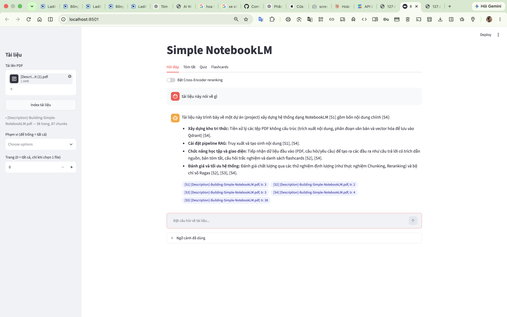
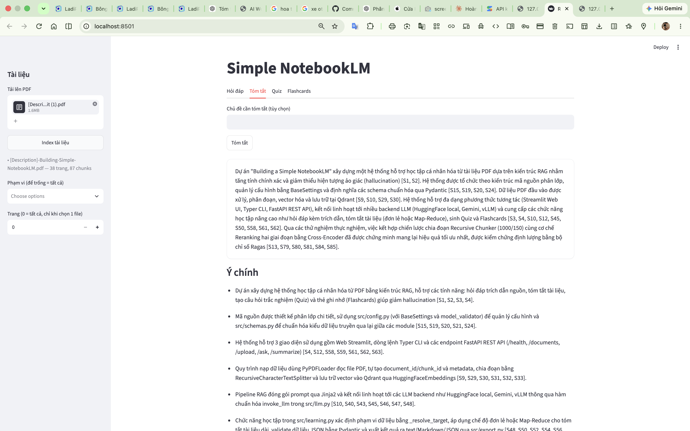
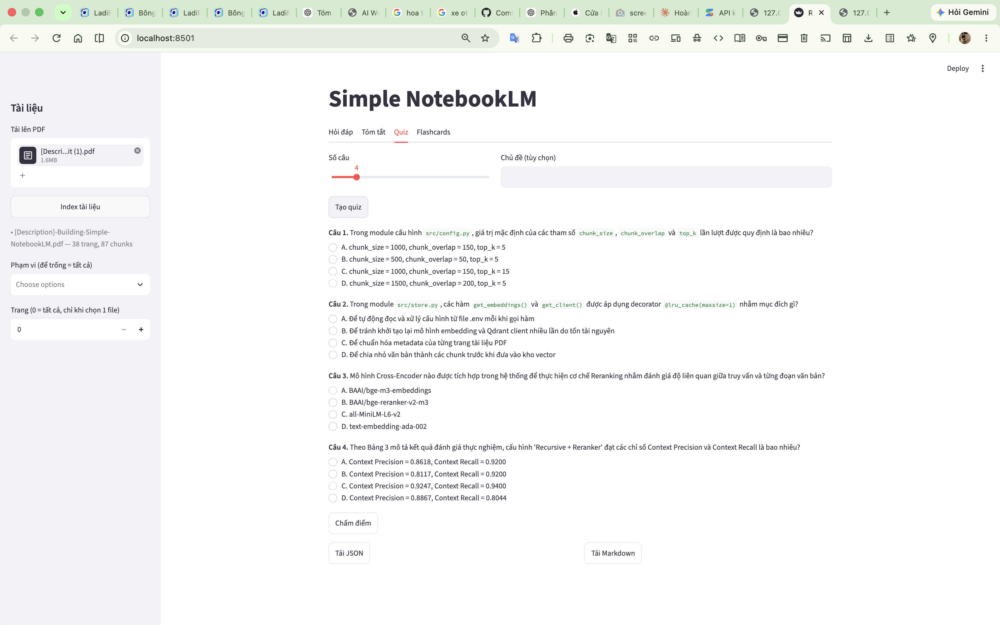
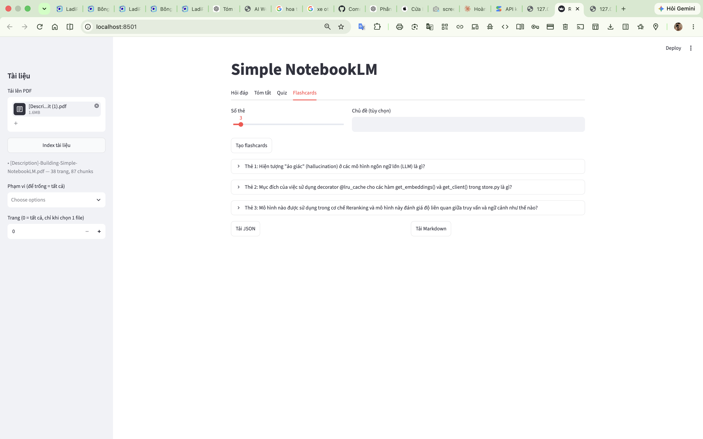

<div align="center">


# 🌷 Simple NotebookLM
### ✦ RAG Learning Assistant for Personal PDFs ✦

<p>
  <i>Biến tài liệu PDF thành một không gian học tập thông minh — hỏi đáp, tóm tắt, quiz và flashcards trong cùng một ứng dụng.</i>
</p>

<br/>


<br/>

**`PDF` → `Chunking` → `Embedding` → `Qdrant` → `Retrieval` → `Reranking` → `Gemini` → `Answer + Citations`**

</div>

---

## ♡ Mục lục

- [🌸 Giới thiệu](#-giới-thiệu)
- [✨ Tính năng](#-tính-năng)
- [🖼️ Demo](#️-demo)
- [🧠 Kiến trúc hệ thống](#-kiến-trúc-hệ-thống)
- [🛠️ Công nghệ sử dụng](#️-công-nghệ-sử-dụng)
- [🚀 Cài đặt](#-cài-đặt)
- [🔑 Cấu hình Gemini API](#-cấu-hình-gemini-api)
- [🖥️ Chạy ứng dụng](#️-chạy-ứng-dụng)
- [⌨️ Sử dụng CLI](#️-sử-dụng-cli)
- [📊 RAG Evaluation](#-rag-evaluation)
- [🧪 Kiểm thử](#-kiểm-thử)
- [📁 Cấu trúc project](#-cấu-trúc-project)
- [⚠️ Lưu ý kỹ thuật](#️-lưu-ý-kỹ-thuật)
- [🤍 AI Assistance](#-ai-assistance)

---

# 🌸 Giới thiệu

**Simple NotebookLM** là một hệ thống học tập trên tài liệu PDF cá nhân sử dụng kiến trúc  
**Retrieval-Augmented Generation — RAG**.

Thay vì để AI trả lời hoàn toàn dựa trên kiến thức có sẵn, hệ thống sẽ tìm những đoạn văn liên quan trực tiếp trong tài liệu của người dùng, xếp hạng lại kết quả và đưa chúng vào prompt trước khi gọi LLM.

> [!TIP]
> Mục tiêu của project là giúp việc học từ PDF trở nên **nhanh hơn, trực quan hơn và có căn cứ nguồn rõ ràng hơn**.

Ứng dụng hỗ trợ:

- 🌷 **Hỏi đáp RAG có trích dẫn nguồn**
- 📝 **Tóm tắt tài liệu theo Map–Reduce**
- 🎀 **Tạo Quiz trắc nghiệm**
- 🧠 **Tạo Flashcards**
- 🔍 **Semantic Retrieval**
- 🏆 **Cross-Encoder Reranking**
- 📊 **Đánh giá RAG với Ragas**
- 🖥️ **Streamlit Web UI**
- ⚡ **FastAPI REST API**
- ⌨️ **Command Line Interface**

---

# ✨ Tính năng

<table>
<tr>
<td width="50%">

### 💬 RAG Question Answering
Hỏi đáp trực tiếp trên PDF và nhận câu trả lời có trích dẫn dạng **[S1] [S2]...**

</td>
<td width="50%">

### 📝 Smart Summary
Tóm tắt tài liệu dài bằng chiến lược **single-pass / map-reduce**.

</td>
</tr>

<tr>
<td>

### 🎯 Quiz Generator
Tự động sinh câu hỏi trắc nghiệm phục vụ ôn tập kiến thức.

</td>
<td>

### 🧠 Flashcards
Tạo bộ thẻ ghi nhớ từ nội dung tài liệu hoặc chủ đề truy vấn.

</td>
</tr>

<tr>
<td>

### 🔎 Semantic Retrieval
Tìm đoạn văn liên quan bằng **embedding**, không chỉ dựa vào từ khóa.

</td>
<td>

### 🏆 Reranking
Dùng **Cross-Encoder** để xếp hạng lại candidate chunks trước khi gửi tới LLM.

</td>
</tr>

<tr>
<td>

### 📊 RAG Evaluation
So sánh chiến lược chunking và reranking bằng **Ragas**.

</td>
<td>

### 📤 Export
Xuất nội dung học tập ra **Markdown / JSON**.

</td>
</tr>
</table>

---

# 🖼️ Demo

Ứng dụng đã được chạy thực tế với một tài liệu PDF **38 trang**, tạo ra **87 chunks** và sử dụng **Gemini** làm LLM backend.

### ✦ Hỏi đáp RAG có trích dẫn

<p align="center">
  
</p>

<p align="center"><i>Trả lời câu hỏi dựa trên tài liệu và hiển thị nguồn tham chiếu.</i></p>

<br/>

### ✦ Tóm tắt tài liệu

<p align="center">
  
</p>

<p align="center"><i>Tổng hợp các ý chính từ PDF theo một bố cục dễ đọc.</i></p>

<br/>

### ✦ Quiz Generator

<p align="center">
  
</p>

<p align="center"><i>Tự động tạo câu hỏi trắc nghiệm từ nội dung học tập.</i></p>

<br/>

### ✦ Flashcards

<p align="center">
  
</p>

<p align="center"><i>Biến kiến thức trong tài liệu thành thẻ ghi nhớ nhanh.</i></p>

---

# 🧠 Kiến trúc hệ thống

```mermaid
flowchart LR
    A["📄 PDF"] --> B["✂️ Chunking"]
    B --> C["🧠 Embedding"]
    C --> D[("🗄️ Qdrant")]

    Q["💭 User Question"] --> E["🔎 Retrieve Top 15"]
    D --> E
    E --> F["🏆 Cross-Encoder Reranker"]
    F --> G["🎯 Top 5 Chunks"]
    G --> H["📝 Jinja2 Prompt"]
    H --> I["✨ Gemini LLM"]
    I --> J["🌷 Answer + Citations"]

    style A fill:#F8C8DC,stroke:#B989A0,color:#4F3F4A
    style B fill:#FBE3EC,stroke:#B989A0,color:#4F3F4A
    style C fill:#E8D9F7,stroke:#9B7FAD,color:#4F3F4A
    style D fill:#D9DFFF,stroke:#8790C0,color:#4F3F4A
    style E fill:#F8E6F0,stroke:#B989A0,color:#4F3F4A
    style F fill:#EADDF8,stroke:#9B7FAD,color:#4F3F4A
    style G fill:#F6EAF9,stroke:#9B7FAD,color:#4F3F4A
    style H fill:#FCE9EF,stroke:#B989A0,color:#4F3F4A
    style I fill:#DCE7FF,stroke:#8790C0,color:#4F3F4A
    style J fill:#F8DDE9,stroke:#B989A0,color:#4F3F4A
```



### Pipeline

```text
📄 PDF
   │
   ▼
✂️ Document Loading & Chunking
   │
   ▼
🧠 Embedding
   │
   ▼
🗄️ Qdrant Vector Store
   │
   ▼
🔎 Semantic Retrieval — Top 15
   │
   ▼
🏆 Cross-Encoder Reranking
   │
   ▼
🎯 Top 5 Relevant Chunks
   │
   ▼
📝 Jinja2 Prompt
   │
   ▼
✨ Gemini LLM
   │
   ▼
🌷 Answer + Source Citations
```

---

# 🛠️ Công nghệ sử dụng

<div align="center">

| ✦ Thành phần | Công nghệ |
|---|---|
| 🐍 Language | **Python** |
| ⚡ Backend | **FastAPI + Uvicorn** |
| 🖥️ Web UI | **Streamlit** |
| 🤖 LLM | **Google Gemini** |
| 🧠 Embedding | **GreenNode/GreenNode-Embedding-Large-VN-Mixed-V1** |
| 🏆 Reranker | **BAAI/bge-reranker-v2-m3** |
| 🗄️ Vector Database | **Qdrant** |
| 🔗 RAG Ecosystem | **LangChain** |
| 📝 Prompt Template | **Jinja2** |
| 📄 PDF Processing | **PyPDF** |
| 📊 Evaluation | **Ragas** |
| 🧪 Testing | **Pytest** |

</div>

---

# 🚀 Cài đặt

## 1. Clone repository

```bash
git clone <YOUR_REPOSITORY_URL>
cd simple-notebooklm
```

## 2. Tạo môi trường ảo

### Windows PowerShell

```powershell
python -m venv .venv
.venv\Scripts\Activate.ps1
```

### Windows CMD

```cmd
python -m venv .venv
.venv\Scripts\activate
```

### Linux / macOS

```bash
python3 -m venv .venv
source .venv/bin/activate
```

## 3. Cài dependencies

```bash
pip install -r requirements.txt
```

Nếu cần chạy evaluation:

```bash
pip install -r requirements-evaluation.txt
```

Nếu cần chạy test:

```bash
pip install -r requirements-dev.txt
```

> [!NOTE]
> Lần chạy đầu, project sẽ tải **Embedding Model** và **Reranker** từ Hugging Face nên có thể mất thêm thời gian và dung lượng.

---

# 🔑 Cấu hình Gemini API

Project đọc cấu hình từ file `.env`.

## 1. Tạo `.env`

### Windows PowerShell

```powershell
Copy-Item .env.example .env
```

### Linux / macOS

```bash
cp .env.example .env
```

## 2. Mở `.env` và điền API key

```env
RAG_LLM_PROVIDER=gemini
GOOGLE_API_KEY=YOUR_GOOGLE_API_KEY
RAG_GEMINI_MODEL=gemini-3.6-flash

RAG_EMBEDDING_MODEL=GreenNode/GreenNode-Embedding-Large-VN-Mixed-V1
RAG_HF_DEVICE=-1

RAG_CHUNK_SIZE=1000
RAG_CHUNK_OVERLAP=150
RAG_TOP_K=5

RAG_RERANKER_MODEL=BAAI/bge-reranker-v2-m3
RAG_RERANK_INITIAL_K=15
RAG_RERANK_TOP_K=5
```

> [!CAUTION]
> **Không upload file `.env`, API key, password hoặc token thật lên GitHub.**  
> Chỉ đưa `.env.example` lên repository.

---

# 📄 Thêm tài liệu

Đặt PDF vào thư mục:

```text
data/
```

Ví dụ:

```text
data/
├── machine_learning.pdf
├── deep_learning.pdf
└── rag_notes.pdf
```

PDF scan chỉ chứa hình ảnh và không có text cần được **OCR trước khi sử dụng**.

---

# 🖥️ Chạy ứng dụng

Ứng dụng Web sử dụng **2 terminal**.

## Terminal 1 — FastAPI

Kích hoạt `.venv`, sau đó chạy:

```bash
uvicorn src.interfaces.api:app --host 0.0.0.0 --port 8000
```

Backend mặc định:

```text
http://localhost:8000
```

---

## Terminal 2 — Streamlit

Kích hoạt `.venv`, sau đó chạy:

```bash
streamlit run src/interfaces/ui.py
```

Giao diện mặc định:

```text
http://localhost:8501
```

<div align="center">

### 🌷 Simple NotebookLM is ready.

`Upload PDF` → `Index` → `Ask` → `Learn`

</div>

---

# ⌨️ Sử dụng CLI

### 📥 Index tài liệu

```bash
python -m src.interfaces.cli ingest --recreate
```

### 💬 Hỏi đáp

```bash
python -m src.interfaces.cli ask "RAG là gì?" --rerank
```

### 🔍 Debug Retrieval

```bash
python -m src.interfaces.cli debug-retrieval "RAG là gì?"
```

### 📝 Tóm tắt

```bash
python -m src.interfaces.cli summarize -d ten_file.pdf --fmt md -o out/summary.md
```

### 🎯 Tạo Quiz

```bash
python -m src.interfaces.cli quiz -d ten_file.pdf -n 8 --fmt json -o out/quiz.json
```

### 🧠 Tạo Flashcards

```bash
python -m src.interfaces.cli flashcards -q "LoRA" -n 10
```

### 🔎 Filter Retrieval

Một file và một trang:

```json
{"filename":"a.pdf","page":3}
```

Nhiều file:

```json
{"filenames":["a.pdf","b.pdf"]}
```

---

# 📊 RAG Evaluation

Project có module đánh giá nhằm so sánh **chunking strategy** và **reranking** bằng Ragas.

## 1. Tạo benchmark từ PDF

```bash
python -m src.evaluation.make_benchmark --n 30
```

Benchmark:

```text
src/evaluation/benchmark_rag.csv
```

> File benchmark đi kèm chỉ chứa một vài dòng ví dụ.  
> Khi dùng với tài liệu thật, nên sinh benchmark mới rồi **đọc lại, sửa và loại các câu kém chất lượng**.

## 2. Chạy thử nhanh

```bash
python -m src.evaluation.run_chunking --strategies rc_1000_150 --limit 5
```

## 3. Đánh giá Chunking đầy đủ

```bash
python -m src.evaluation.run_chunking
```

## 4. Đánh giá Reranking

```bash
python -m src.evaluation.run_reranking
```

Xem demo vector retrieval và reranking:

```bash
python -m src.evaluation.run_reranking --demo
```

## 5. Tạo báo cáo

```bash
python -m src.evaluation.report
```

Kết quả được lưu trong:

```text
src/evaluation/results/
```

Bao gồm:

- `JSON` kết quả từng cấu hình
- `CSV` kết quả theo từng câu
- `report.md`
- `chart_chunking.png`
- `chart_reranking.png`

> [!IMPORTANT]
> Ragas có thể tạo nhiều lời gọi LLM.  
> Khi thử nghiệm, nên dùng `--limit`, giảm `--max-workers` nếu gặp rate limit và dùng `--skip-existing` để tiếp tục kết quả cũ.

---

# 🧪 Kiểm thử

Cài dependency:

```bash
pip install -r requirements-dev.txt
```

Chạy:

```bash
pytest -q
```

Project hiện có:

```text
✅ 51 automated tests
```

Bao phủ các phần:

- Chunking & metadata
- Re-ingest
- Filter
- Retrieval
- RAG + Citation
- Reranking
- Summary
- Quiz
- Flashcards
- Export
- CLI
- REST API
- Streamlit UI
- Evaluation pipeline
- Ragas report

---

# 📁 Cấu trúc project

```text
simple-notebooklm/
│
├── 🌷 assets/
│   └── screenshots/
│       ├── rag-answer.png
│       ├── summary.png
│       ├── quiz.png
│       └── flashcards.png
│
├── 📚 data/
│   └── .gitkeep
│
├── 🧠 src/
│   ├── evaluation/
│   │   ├── benchmark_rag.csv
│   │   ├── chunking_strategies.py
│   │   ├── make_benchmark.py
│   │   ├── ragas_evaluator.py
│   │   ├── report.py
│   │   ├── run_chunking.py
│   │   └── run_reranking.py
│   │
│   ├── interfaces/
│   │   ├── api.py
│   │   ├── cli.py
│   │   ├── styles.py
│   │   └── ui.py
│   │
│   ├── prompts/
│   │   ├── answer.jinja2
│   │   ├── flashcards.jinja2
│   │   ├── quiz.jinja2
│   │   ├── summary_map.jinja2
│   │   ├── summary_reduce.jinja2
│   │   └── summary_single.jinja2
│   │
│   ├── config.py
│   ├── export.py
│   ├── filters.py
│   ├── indexing.py
│   ├── learning.py
│   ├── llm.py
│   ├── rag.py
│   ├── reranker.py
│   ├── schemas.py
│   └── store.py
│
├── 🧪 tests/
│
├── .env.example
├── .gitignore
├── pyproject.toml
├── requirements.txt
├── requirements-dev.txt
├── requirements-evaluation.txt
└── README.md
```

---

# ⚠️ Lưu ý kỹ thuật

<details>
<summary><b>🗄️ Qdrant Local</b></summary>

<br/>

Qdrant local chỉ cho một process mở:

```text
storage/qdrant
```

Không nên chạy API/UI đồng thời với CLI hoặc evaluation script nếu tất cả cùng dùng local storage.

Nếu muốn chạy song song, sử dụng Qdrant Server:

```bash
docker run -p 6333:6333 qdrant/qdrant
```

Sau đó thêm vào `.env`:

```env
RAG_QDRANT_URL=http://localhost:6333
```

</details>

<details>
<summary><b>🔗 LangChain version</b></summary>

<br/>

Project ghim:

```text
langchain-community==0.3.31
```

do yêu cầu tương thích với **Ragas 0.4.x**.

</details>

<details>
<summary><b>🏆 Reranker</b></summary>

<br/>

Trong evaluation, Cross-Encoder không âm thầm fallback để tránh tạo kết quả đánh giá sai.

Trong app, chế độ `--rerank` có thể fallback lexical và ghi cảnh báo trong log nếu model không tải được.

</details>

<details>
<summary><b>📷 PDF Scan</b></summary>

<br/>

PDF không có text sẽ bị từ chối khi upload.

```text
Scanned PDF
    ↓
   OCR
    ↓
Simple NotebookLM
```

</details>

<details>
<summary><b>🤖 LLM Providers</b></summary>

<br/>

Project hỗ trợ:

```env
RAG_LLM_PROVIDER=gemini
```

hoặc:

```text
gemini
vllm
hf_local
```

Model local tùy chọn trong cấu hình:

```text
Qwen/Qwen3-4B-Instruct-2507
```

</details>

---

# 👩🏻‍💻 Thành viên

<div align="center">

### ✦ Nhóm phát triển ✦

**Nguyễn Văn An** — `24100254`  
**Đào Bá Tuấn Ngọc** — `24100498`  
**Phạm Thế Duy** — `24100583`  
**Phạm Thảo Hiền Vy** — `24100439`

</div>

---

# 🤍 AI Assistance

Trong quá trình xây dựng và hoàn thiện project, nhóm có sử dụng sự hỗ trợ từ:

<div align="center">

### ✨ ChatGPT — GPT-5.6 Sol

</div>

AI được sử dụng để hỗ trợ:

- 💡 Tham khảo và phát triển ý tưởng
- 📚 Giải thích khái niệm kỹ thuật
- 🧩 Phân tích và hỗ trợ sửa lỗi
- 📝 Hoàn thiện tài liệu dự án
- 🎨 Trình bày README

> Việc lựa chọn giải pháp, kiểm tra chức năng và hoàn thiện sản phẩm được thực hiện bởi nhóm dự án.

---

# 🔐 Security

> [!CAUTION]
> Không commit các dữ liệu nhạy cảm sau lên repository public:

```text
.env
GOOGLE_API_KEY
API Tokens
Passwords
Private Keys
```

Chỉ commit:

```text
.env.example
```

---

# 📚 Tham khảo

Project được xây dựng theo định hướng:

> **AIO2025 — Building a Simple NotebookLM**

và sử dụng các công nghệ trong hệ sinh thái:

`LangChain` · `Qdrant` · `Hugging Face` · `FastAPI` · `Streamlit` · `Ragas`

---

<div align="center">

### ୨୧ Simple NotebookLM ୨୧

**Learn beautifully. Search intelligently. Remember effortlessly.**

<br/>

`📄`　→　`🧠`　→　`🔎`　→　`✨`　→　`🌷`

<br/>

**If you find this project useful, a ⭐ would mean a lot.**


</div>
